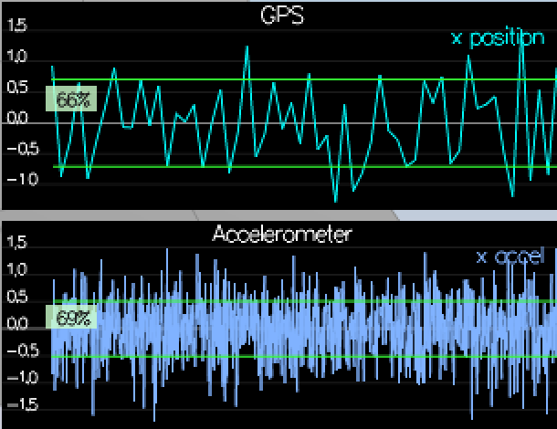
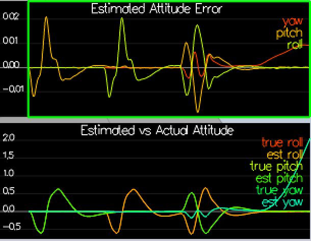

### Step 1: Sensor Noise ###

I used python and numpy to calculate standard deviations ([scenario6.py](scenario6.py)):

```python
import numpy as np

gps = np.loadtxt(open("config/log/Graph1.txt", "rb"), delimiter=",", skiprows=1, dtype='Float64')
print("GPS std: ", np.std(gps[:,1]))

acc = np.loadtxt(open("config/log/Graph2.txt", "rb"), delimiter=",", skiprows=1, dtype='Float64')
print("ACC std: ", np.std(acc[:,1]))
```

Result:
```
GPS std:  0.704375122559
ACC std:  0.509920269748
```



### Step 2: Attitude estimation ###

I used `Quaternion<float>` class `FromEuler123_RPY()` for creating quaternion from Euler Roll/Pitch/Yaw
and then used `IntegrateBodyRate()` to get updated attitude.

```c++
Quaternion<float> attitude = Quaternion<float>::FromEuler123_RPY(rollEst, pitchEst, ekfState(6));
Quaternion<float> attitude_update = attitude.IntegrateBodyRate(gyro, dtIMU);

float predictedPitch = attitude_update.Pitch();
float predictedRoll = attitude_update.Roll();
ekfState(6) = attitude_update.Yaw();
```

Result:

