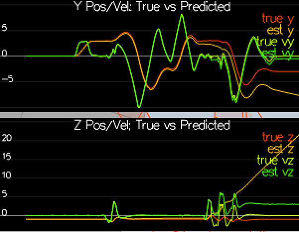
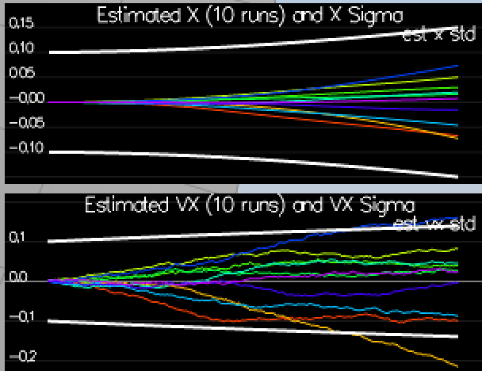
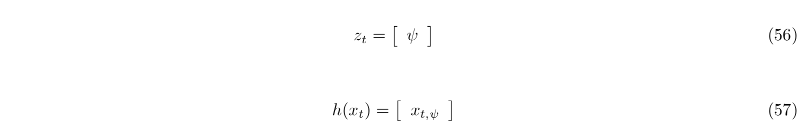
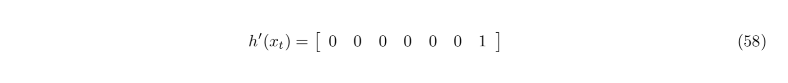
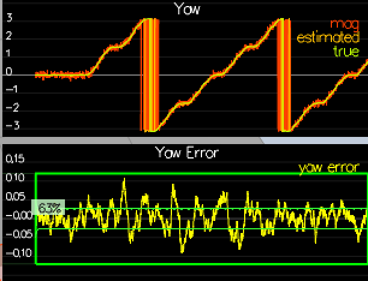
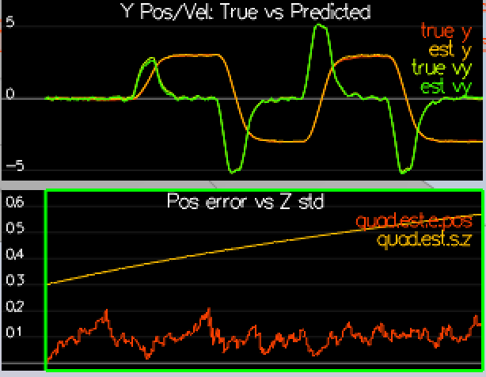
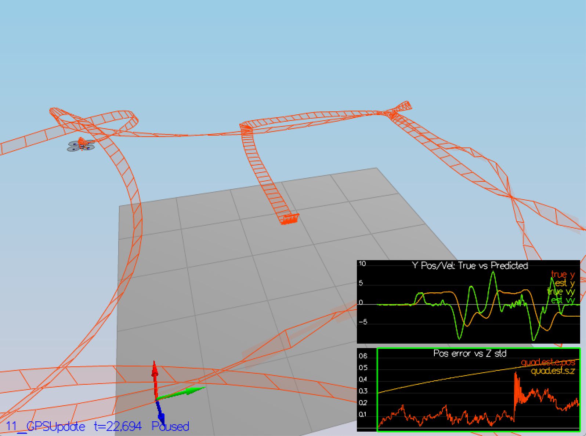

### Step 1: Sensor Noise ###

I used python and numpy to calculate standard deviations ([scenario6.py](scenario6.py)):

```python
import numpy as np

gps = np.loadtxt(open("config/log/Graph1.txt", "rb"), delimiter=",", skiprows=1, dtype='Float64')
print("GPS std: ", np.std(gps[:,1]))

acc = np.loadtxt(open("config/log/Graph2.txt", "rb"), delimiter=",", skiprows=1, dtype='Float64')
print("ACC std: ", np.std(acc[:,1]))
```

Result:
```
GPS std:  0.704375122559
ACC std:  0.509920269748
```


### Step 2: Attitude estimation ###

I used `Quaternion<float>` class `FromEuler123_RPY()` for creating quaternion from Euler Roll/Pitch/Yaw
and then used `IntegrateBodyRate()` to get updated attitude.

```c++
Quaternion<float> attitude = Quaternion<float>::FromEuler123_RPY(rollEst, pitchEst, ekfState(6));
Quaternion<float> attitude_update = attitude.IntegrateBodyRate(gyro, dtIMU);

float predictedPitch = attitude_update.Pitch();
float predictedRoll = attitude_update.Roll();
ekfState(6) = attitude_update.Yaw();
```

Result:


### Step 3: Prediction step

#### Predict mean ####

I integrate position forward by timestep `dt`:

```c++
predictedState(0) = curState(0) + dt * curState(3); // x
predictedState(1) = curState(1) + dt * curState(4); // y
predictedState(2) = curState(2) + dt * curState(5); // z
```

To integrate velocity, I converted accelerations from body frame to inertia frame:
```c++
V3F accelInertia = attitude.Rotate_BtoI(accel);
```

and then by integrated velocity by timestep `dt`:
```c++
predictedState(3) = curState(3) + dt * accelInertia.x; // x_dot
predictedState(4) = curState(4) + dt * accelInertia.y; // y_dot
predictedState(5) = curState(5) + dt * accelInertia.z - dt * CONST_GRAVITY; // z_dot
```

Result:



```
PASS: ABS(Quad.Est.E.MaxEuler) was less than 0.100000 for at least 3.000000 seconds
Simulation #10 (../config/08_PredictState.txt)
```

#### Predict covariance ####

First thing was to create partial derivative of the body-to-global rotation matrix, which I just
defining formula `52` from `Estimation for Quadrotors` chapter `7.2 Transition model`:
```c++
RbgPrime(0, 0) = -cos(theta)*sin(psi);
RbgPrime(0, 1) = -sin(phi)*sin(theta)*sin(psi)-cos(phi)*cos(psi);
RbgPrime(0, 2) = -cos(phi)*sin(theta)*sin(psi)+sin(phi)*cos(psi);

RbgPrime(1, 0) = cos(theta)*cos(psi);
RbgPrime(1, 1) = sin(phi)*sin(theta)*cos(psi)-cos(phi)*cos(psi);
RbgPrime(1, 2) = cos(phi)*sin(theta)*sin(psi)+sin(phi)*cos(psi);
```

Then I implemented predict function by creating Jacobian:
```c++
gPrime(0,3) = dt;
gPrime(1,4) = dt;
gPrime(2,5) = dt;
gPrime(3, 6) = (RbgPrime(0) * accel).sum() * dt;
gPrime(4, 6) = (RbgPrime(1) * accel).sum() * dt;
gPrime(5, 6) = (RbgPrime(2) * accel).sum() * dt;
```

and updated covariance:
```c++
ekfCov = gPrime * ekfCov * gPrime.transpose() + Q;
```

Result was this:



### Step4: Magnetometer update ###

First I updated Step 5: Closed Loop + GPS UpdateQYawStd` parameter to value `0.07`, so it would approximately captures the magnitude of the drift.

I then implemented magnetometer update step using formulas from `Estimation for Quadrotors` chapter `7.3.2 Magnetometer`:





I also normalized the difference between measured and estimated yaw. 

This was the result I got:



### Step 5: Closed Loop + GPS Update ###

I tuned the process noise model and implemented GPS update step using formulas from `Estimation for Quadrotors` chapter `7.3.1 GPS`.

h prime is basically identity matrix, without last row as GPS doesn't have orientation, just direction of travel:

```c++
hPrime(0, 0) = 1;
hPrime(1, 1) = 1;
hPrime(2, 2) = 1;
hPrime(3, 3) = 1;
hPrime(4, 4) = 1;
hPrime(5, 5) = 1;
```

I then calculated measurement prediction:

```c++
zFromX = hPrime * ekfState;
```

This was the result:


### Step 6: Adding you controller

Replaced `QuadController.cpp` and `QuadControlParams.txt` and run scenario `11_GPSUpdate`. Surprisingly quad flied within 
allowed error limits without needed any de-tuning. Although the flight path was a little bit chaotic:




Result:

```
Simulation #4 (../config/11_GPSUpdate.txt)
PASS: ABS(Quad.Est.E.Pos) was less than 1.000000 for at least 20.000000 seconds
```